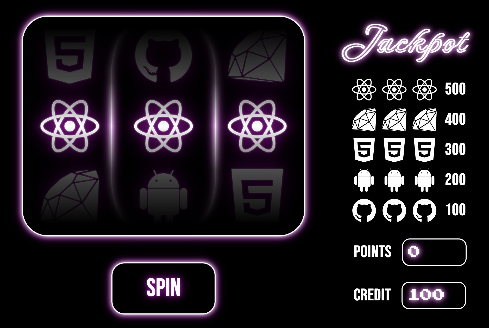

While looking at the code of the Guardian newspaper website I stumbled accross thier developer interview process. One of the pair programming exercises used in interviews is to make a basic fruit machine. This gave me the idea to try and build my own fruit machine from HTML, CSS & Javascript. 

While looking for images of fruit machines online I saw some neon light style images and used this as inspriration. This is my own original design incorporating the logos from different programming languages as the "fruit". I used a marquee effect to give the illusion of spinning wheels and found some slot machine sound effects online to play when spinning. A random number generator is used to choose which logo to display in each slot.

Try your luck! Keep spinning until you get a match!

https://andyferrie.github.io/FruitMachine/
